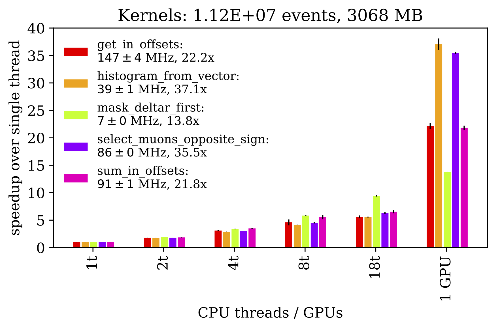
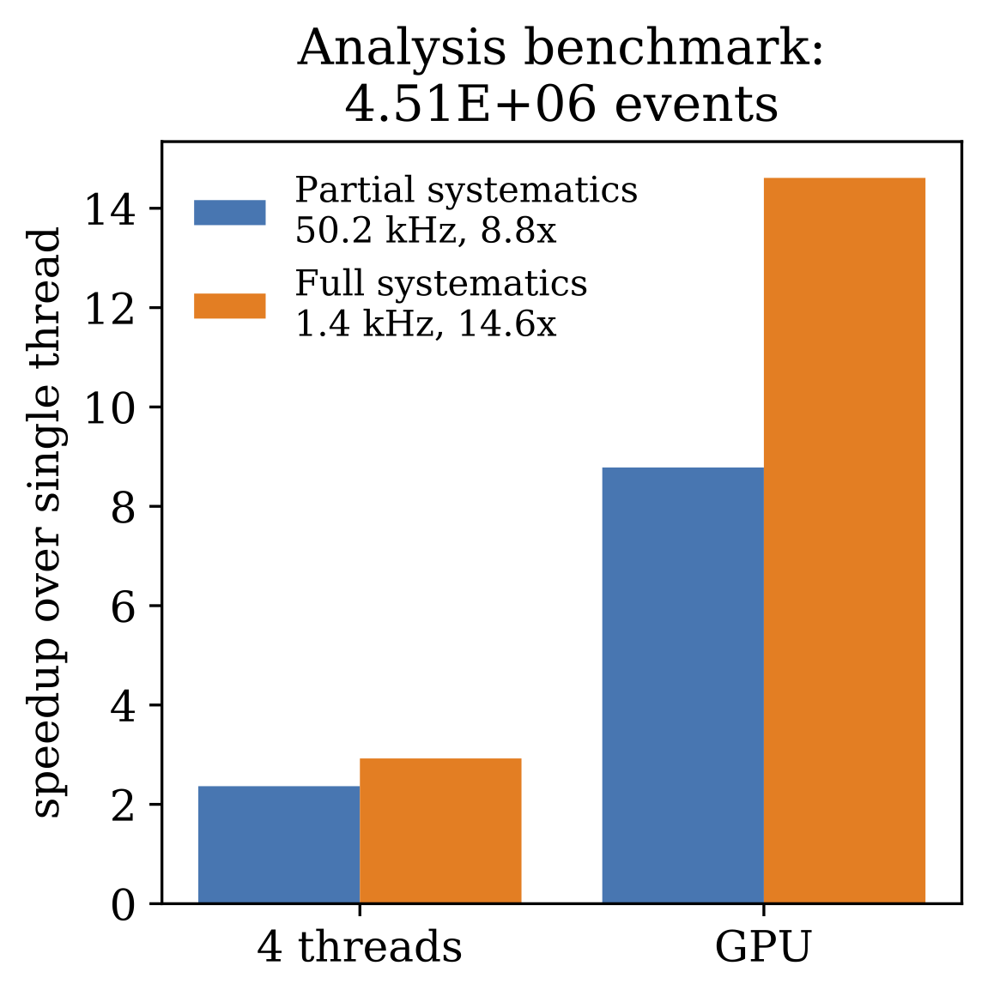

[](https://travis-ci.com/hepaccelerate/hepaccelerate)
[](https://gitlab.cern.ch/jpata/hepaccelerate/commits/master)
[](https://zenodo.org/badge/latestdoi/191644111)

# hepaccelerate

Accelerated array analysis on flat ROOT data. Process 1 billion events to histograms in minutes on a single workstation.
Weighted histograms, jet-lepton deltaR matching and more! Works on both the CPU and GPU!

<p float="left">
  
  
</p>

## Installation

~~~
pip install git+https://github.com/jpata/hepaccelerate@v0.1.0
~~~

Required python libraries:
 - python 3
 - uproot
 - awkward-array
 - numba (>0.43)

Optional libraries for CUDA acceleration:
 - cupy
 - cudatoolkit

## Documentation
This code consists of two parts which can be used independently:
  - the accelerated HEP kernels that run on jagged data in [backend_cpu.py](hepaccelerate/backend_cpu.py) and [backend_cuda.py](hepaccelerate/backend_cuda.py)  
  - JaggedStruct, Dataset and Histogram classes to help with HEP dataset management

## Usage

This is a minimal example from [examples/simple_hzz.py](../blob/master/examples/simple_hzz.py), which can be run from this repository directly using
~~~
PYTHONPATH=. python3 examples/simple_hzz.py
PYTHONPATH=. HEPACCELERATE_CUDA=1 python3 examples/simple_hzz.py
~~~

```python
#usr/bin/env python3
#Run as PYTHONPATH=. python3 examples/simple_hzz.py

#In case you use CUDA, you may have to find the libnvvm.so on your system manually
import os
os.environ["NUMBAPRO_NVVM"] = "/usr/local/cuda/nvvm/lib64/libnvvm.so"
os.environ["NUMBAPRO_LIBDEVICE"] = "/usr/local/cuda/nvvm/libdevice/"
import numba

import hepaccelerate
from hepaccelerate.utils import Results, Dataset, Histogram, choose_backend

#choose whether or not to use the GPU backend
use_cuda = int(os.environ.get("HEPACCELERATE_CUDA", 0)) == 1
NUMPY_LIB, ha = choose_backend(use_cuda=use_cuda)

#define our analysis function
def analyze_data_function(data, parameters):
    ret = Results()

    num_events = data["num_events"]
    muons = data["Muon"]
    mu_pt = NUMPY_LIB.sqrt(muons.Px**2 + muons.Py**2)
    muons.attrs_data["pt"] = mu_pt

    mask_events = NUMPY_LIB.ones(muons.numevents(), dtype=NUMPY_LIB.bool)
    mask_muons_passing_pt = muons.pt > parameters["muons_ptcut"]
    num_muons_event = ha.sum_in_offsets(muons, mask_muons_passing_pt, mask_events, muons.masks["all"], NUMPY_LIB.int8)
    mask_events_dimuon = num_muons_event == 2

    #get the leading muon pt in events that have exactly two muons
    inds = NUMPY_LIB.zeros(num_events, dtype=NUMPY_LIB.int32)
    leading_muon_pt = ha.get_in_offsets(muons.pt, muons.offsets, inds, mask_events_dimuon, mask_muons_passing_pt)

    #compute a weighted histogram
    weights = NUMPY_LIB.ones(num_events, dtype=NUMPY_LIB.float32)
    bins = NUMPY_LIB.linspace(0,300,101)
    hist_muons_pt = Histogram(*ha.histogram_from_vector(leading_muon_pt[mask_events_dimuon], weights[mask_events_dimuon], bins))

    #save it to the output
    ret["hist_leading_muon_pt"] = hist_muons_pt
    return ret

#Load this input file
filename = "data/HZZ.root"

#Predefine which branches to read from the TTree and how they are grouped to objects
#This will be verified against the actual ROOT TTree when it is loaded
datastructures = {
            "Muon": [
                ("Muon_Px", "float32"),
                ("Muon_Py", "float32"),
                ("Muon_Pz", "float32"), 
                ("Muon_E", "float32"),
                ("Muon_Charge", "int32"),
                ("Muon_Iso", "float32")
            ],
            "Jet": [
                ("Jet_Px", "float32"),
                ("Jet_Py", "float32"),
                ("Jet_Pz", "float32"),
                ("Jet_E", "float32"),
                ("Jet_btag", "float32"),
                ("Jet_ID", "bool")
            ],
            "EventVariables": [
                ("NPrimaryVertices", "int32"),
                ("triggerIsoMu24", "bool"),
                ("EventWeight", "float32")
            ]
    }

dataset = Dataset("HZZ", [filename], datastructures, cache_location="./mycache/", treename="events")

#load data to memory
try:
    dataset.from_cache(verbose=True)
    print("Loaded data from cache, did not touch original ROOT files.")
except FileNotFoundError as e:
    print("Cache not found, creating...")
    dataset.load_root()
    dataset.to_cache()

#process data
results = dataset.analyze(analyze_data_function, verbose=True, parameters={"muons_ptcut": 30.0})
results.save_json("out.json")
```

A more complete CMS analysis example an be found in [analysis_hmumu.py](https://github.com/hepaccelerate/hepaccelerate-cms/blob/master/tests/hmm/analysis_hmumu.py). Currently, for simplicity and in the spirit of prototyping, that repository comes batteries-included with CMS-specific analysis methods.

## Recommendations on data locality and remote data
In order to make full use of modern CPUs or GPUs, you want to bring the data as close as possible to where the work is done, otherwise you will spend most of the time waiting for the data to arrive rather than actually performing the computations.

With CMS NanoAOD with event sizes of 1-2 kB/event, 1 million events is approximately 1-2 GB on disk. Therefore, you can fit a significant amount of data used in a HEP analysis on a commodity SSD. In order to copy the data to your local disk, use grid tools such as `gfal-copy` or even `rsync` to fetch it from your nearest Tier2. Preserving the filename structure (`/store/...`) will allow you to easily run the same code on multiple sites.

## Frequently asked questions

 - *Why are you doing this array-based analysis business?* Mainly out of curiosity, and I could not find a tool available with which I could do HEP analysis on data on a local disk with MHz rates. It is possible that dask/spark/RDataFrame will soon work well enough for this purpose, but until then, I can justify writing a few functions.
 - *How does this relate to the awkward-array project?* We use the jagged structure provided by the awkward arrays, but implement common HEP functions such as deltaR matching as parallelizable loops or 'kernels' running directly over the array contents, taking into account the event structure. We make these loops fast with Numba, but allow you to debug them by going back to standard python when disabling the compilation.
 - *How does this relate to the coffea/fnal-columnar-analysis-tools project?* It's very similar, you should check out that project! We implement less methods, mostly by explicit loops in Numba, and on GPUs as well as CPUs.
 - *Why don't you use the array operations (`JaggedArray.sum`, `argcross` etc) implemented in awkward-array?* They are great! However, in order to easily use the same code on either the CPU or GPU, we chose to implement the most common operations explicitly, rather than relying on numpy/cupy to do it internally. This also seems to be faster, at the moment.
 - *What if I don't have access to a GPU?* You should still be able to see event processing speeds in the hundreds of kHz to a few MHz for common analysis tasks.
 - *How do I plot my histograms that are saved in the output JSON?* Load the JSON contents and use the `edges` (left bin edges, plus last rightmost edge), `contents` (weighted bin contents) and `contents_w2` (bin contents with squared weights, useful for error calculation) to access the data directly.
 - *I'm a GPU programming expert, and I worry your CUDA kernels are not optimized. Can you comment?* Good question! At the moment, they are indeed not very optimized, as we do a lot of control flow (`if` statements) in them. However, the GPU analysis is still about 2x faster than a pure CPU analysis, as the CPU is more free to work on loading the data, and this gap is expected to increase as the analysis becomes more complicated (more systematics, more templates). At the moment, we see pure GPU processing speeds of about 8-10 MHz for in-memory data, and data loading from cache at about 4-6 MHz. Have a look at the nvidia profiler results [nvprof1](profiling/nvprof1.png), [nvprof2](profiling/nvprof2.png) to see what's going on under the hood. Please give us a hand to make it even better!
 - *What about running this code on multiple machines?* You can do that, currently just using usual batch tools, but we are looking at other ways (dask, joblib, spark) to distribute the analysis across multiple machines. 
 - *What about running this code on data that is remote (XROOTD)?* You can do that thanks to the `uproot` library, but then you gain very little benefit from having a fast CPU or GPU, as you will spend most of your time just waiting for input.
 - *How much RAM is needed?* The amount of RAM determines how much data can be preloaded to memory. You can either process data in memory all at once, which makes rerunning very fast, or set up a batched pipeline. In case of the batched pipeline, no more than a few GB/thread of RAM is needed, and overall processing speeds are still around the MHz-level.
